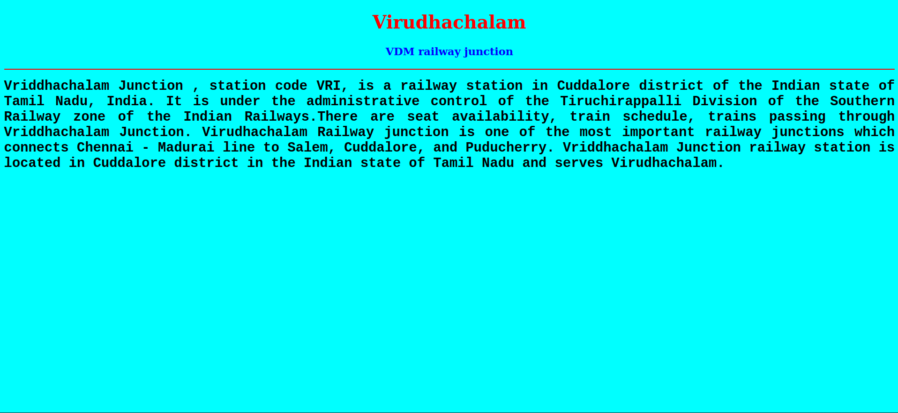

# Places Around Me
## AIM:
To develop a website to display details about the places around my house.

## Design Steps:

### Step 1:
Clone the github repository into Theia IDE.

### Step 2:
Create a new Django project

### Step 3:
Write the needed HTML Code.

### Step 4:
Run the Django server and execute the HTML files.

## Code:
```
map.html
<!DOCTYPE html>
<html lang="en">
<head>
<title>My City</title>
</head>
<body>
<h1 align="center">
<font color="red"><b>Virudhachalam</b></font>
</h1>
<h3 align="center">
<font color="blue"><b>Subalakshmi.V (22008035)</b></font>
</h3>
<center>

<map name="MyCity">
<area shape="circle" coords="190,50,20" href="/static/html/ihs.html" title="Infant Higher Secondary School">
<area shape="rectangle" coords="230,30,260,60" href="/static/html/train.html" title="VDM railway junction">
<area shape="circle" coords="400,350,50" href="/static/html/temple.html" title="Viruthagrieswarar Temple">
<area shape="circle" coords="400,200,75" href="/static/html/bus.html" title="VDM Bus Stand">
<area shape="rectangle" coords="490,150,870,320" href="/static/html/park.html" title="Nehru Park">
</map>
</center>
</body>
</html>


bus.html
<!DOCTYPE html>
<html lang="en">
<head>
<title>Bus Stand</title>
</head>
<body bgcolor="cyan">
<h1 align="center">
<font color="red"><b>Virudhachalam</b></font>
</h1>
<h3 align="center">
<font color="blue"><b>Hi-Tech Bus Stand</b></font>
</h3>
<hr size="3" color="red">
<p align="justify">
<font face="Courier New" size="5">
<b>
Virudhachalam or Vriddhachalam is a Town and taluk headquarters in Cuddalore district in the Indian state of Tamil Nadu. The ancient name of this town is Thirumudhukundram. As per the 2011 census, the town had a population of 73,585 of which 37,066 are males while 36,519 are females. Population of children in the ages of 0-6 is 7735 which is 10.51 % of the total population.[1] The old Lord Siva temple (Pazhamalai Nadhar Temple or Viruthagireeswarar temple) is located in the heart of town.[2] This is the 41st Devaram Padal Petra Siva Thiruthalam and 9th Thiruthalam in Nadu Naadu
.Moovar has sung hymns in praise of Lord Siva of this temple. The temple was constructed by one of the Chola Emperors. The famous Kolanjiappar Temple is located 3 km away from the town. Both of them are situated near Cuddalore - Salem highway in Virudhachalam. 
The overall journey duration of Virudhachalam and Coimbatore is around 6h. Although the duration of the journey depends on the bus you are booking. This difference in time can mainly happen due to differences in routes and the number of stops. You can find regular stoppages throughout the journey. Most of the time, these stoppages are at eminent food joints. Although the duration of the halt is generally short, you can utilize this time period for eating and getting freshened up.
 The bus service starts in the morning. Several buses are available at specific intervals till night. For more details regarding the timings, you can check out the MakeMyTrip portal.Different kinds of buses are available for travelling from Virudhachalam to Coimbatore including ordinary buses, non-AC deluxe buses, AC deluxe buses and Volvo buses. There are also some buses that are built for longer journeys. They offer curtains as well as reclining seats.

</font>
</p>
</body>
</html>

ihs.html
<!DOCTYPE html>
<html lang="en">
<head>
<title>Infant Higher Secondary School</title>
</head>
<body bgcolor="lime">
<h1 align="center">
<font color="red"><b>Virudhachalam</b></font>
</h1>
<h3 align="center">
<font color="blue"><b>Infant Higher Secondary School</b></font>
</h3>
<hr size="3" color="red">
<p align="justify">
<font face="Georgia" size="5">
The main objectives of Infant Higher Secondary School are 
<ul>
<li>To impart proper and qualified training to teachers and give them an attractive salary and incentives so that they are not tempted to quit and look elsewhere for jobs.</li>
<li>To provide financial aids and grants wisely and judiciously.</li>
<li>To Frame of syllabus and curriculum.</li>
<li>To set aims and objectives of education.</li>
</ul>
</font>
</p>
</body>
</html>

park.html
<!DOCTYPE html>
<html lang="en">
<head>
<title>Nehru Park</title>
</head>
<body bgcolor="yellow">
<h1 align="center">
<font color="red"><b>Virudhachalam</b></font>
</h1>
<h3 align="center">
<font color="blue"><b>Nehru Park</b></font>
</h3>
<hr size="3" color="red">
<p align="justify">
<font face="Tahoma" size="5">
A very nice park near virudhachalam bus stand. It is located surrounding the manimuthar bridge. 
Very superb calm place in virudhachalam. Best for walking. Nice playing place for kids.
Well maintained with jogging track. Source of ground water.
Good place play with children.  In Banyan Tree lot of parrot stay like house. 
Good sound and Air. Lake view park looks awesome.
Very nice place at Virudhachalam.
Simple and relax with play area.
</font>
</p>
</body>
</html>

temple.html
<!DOCTYPE html>
<html lang="en">
<head>
<title>Viruthagrieswarar Temple</title>
</head>
<body bgcolor="pink">
<h1 align="center">
<font color="red"><b>Virudhachalam</b></font>
</h1>
<h3 align="center">
<font color="blue"><b>Viruthagrieswarar Temple</b></font>
</h3>
<hr size="3" color="red">
<p align="justify">
<font face="Arial" size="5">
<b>
The Virudhagiriswarar Temple is a Hindu temple in the town of Virudhachalam, Cuddalore district of Tamil Nadu, India. The presiding deity Virudhagiriswarar is revered in Tevaram, written by Tamil saint poets known as the nayanmars and classified as Paadal Petra Sthalam. The temple gives its name to the town of Virudhachalam. The temple is famed for the legend of Shiva forming as a mountain heeding to the prayers of Brahma.
Virudhagirswarar temple is a part of the series of temples built by Sembiya Madevi, the Chola queen along the banks of river Kaveri. It has several inscriptions dating back to the Chola period. The temple has six daily rituals at various times from 5:30 a.m. to 8 p.m., and three yearly festivals on its calendar. The annual Brahmotsavam (prime festival), Masi Magam, is attended by thousands of devotees from far and near. The temple is maintained and administered by the Hindu Religious and Endowment Board of the Government of Tamil Nadu.
</b>
</font>
</p>
</body>
</html>

train.html
<!DOCTYPE html>
<html lang="en">
<head>
<title>VDM railway junction</title>
</head>
<body bgcolor="cyan">
<h1 align="center">
<font color="red"><b>Virudhachalam</b></font>
</h1>
<h3 align="center">
<font color="blue"><b>VDM railway junction</b></font>
</h3>
<hr size="3" color="red">
<p align="justify">
<font face="Courier New" size="5">
<b>
Vriddhachalam Junction , station code VRI, is a railway station in Cuddalore district of the Indian state of Tamil Nadu, India. It is under the administrative control of the Tiruchirappalli Division of the Southern Railway zone of the Indian Railways.There are seat availability, train schedule, trains passing through Vriddhachalam Junction.
Virudhachalam Railway junction is one of the most important railway junctions which connects Chennai - Madurai line to Salem, Cuddalore, and Puducherry. Vriddhachalam Junction railway station is located in Cuddalore district in the Indian state of Tamil Nadu and serves Virudhachalam.
</b>
</font>
</p>
</body>
</html>
```

## Output:





## HTML Validator


## Result:
The program for implementing image map is executed successfully